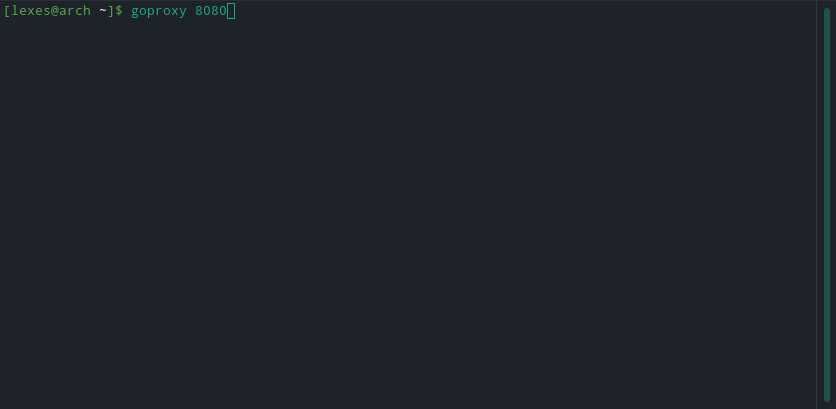

# go-web-proxy-server



Web proxy server implemented in Go with caching and blocking features

## Getting started

### Prerequisites

You will need to have installed:

1. Golang

### Commands available

#### `block`

Blocks the domain specified e.g. `block www.example.com` blocks any
connections to `www.example.com`

```
usage: block <domain name>
```

#### `unblock`

Unblocks the domain specified e.g. `unblock www.example.com` unblocks any
connections to `www.example.com`

```
usage: block <domain name>
```

#### `metrics`

```
usage: metrics
```

Prints out the time saved and bandwidth saved metrics from using the local
cache

#### `clear`

```
usage: clear
```

Clears the console output

### Installing

1. Run the `go get` command
   ```
   go get github.com/lexesjan/go-web-proxy-server/cmd/goproxy
   ```
1. Run the proxy
   ```
   goproxy <port number>
   ```

### Building and running

1. Clone the repo
   ```
   git clone https://github.com/lexesjan/go-web-proxy-server.git
   ```
1. Navigate into the cloned GitHub repository
   ```
   cd go-web-proxy-server
   ```
1. Build the proxy
   ```
   go build ./cmd/proxy
   ```
1. Run the proxy
   ```
   ./goproxy <port number>
   ```

### Building and installing

1. Clone the repo
   ```
   git clone https://github.com/lexesjan/go-web-proxy-server.git
   ```
1. Navigate into the cloned GitHub repository
   ```
   cd go-web-proxy-server
   ```
1. Install the proxy
   ```
   go install ./cmd/goproxy
   ```
1. Run the proxy
   ```
   goproxy <port number>
   ```

## Implementation

### Request handling

The requests are handled using a TCP server. An infinite while loop
continuously listens for connections and accept them. Each connection is then
handled using the `handleConnection()` function. This function determines the
type of protocol used and calls the `handleHTTPS()` or `handleHTTP()`
functions respectively. The HTTP verb `CONNECT` differentiates a HTTP and
HTTPS connection.

#### HTTPS

The `handleHTTPS()` handles all HTTPS connections between the client and the
host server. The URL host along with the port is extracted from the `Host`
header. This is used when establishing a TCP connection with the desired host
server. The proxy server then sends a `HTTP/1.1 200 Connection Established`
response to signify that the client can now start a TLS handshake. The web
proxy now acts as a middle man between the client and the host server. The
web proxy simply forwards any data between the client and the host server
without parsing it.

#### HTTP

The `handleHTTP()` handles all the HTTP connections between the client and
the host server. Upon receiving a HTTP request, the request is parsed using
the `http` package. The `NewRequest()` function parses the status line,
headers and the body if it exists. The standard package `bufio` is used to
read the HTTP message one line at a time. The status line is read and stored
into a `Response` struct. The headers are then read and parsed. If the
`Content-Length` header exists, then the body is also read and parsed.

Using the newly created `Request` struct, the host header is used to
establish a TCP connection with the host server. The `httpclient` package is
then used to send the request status line along with the headers and the body
to the host server. The response is then parsed using the `NewResponse()`
function in the `http` package. The `Response` struct is created which stores
all the information from the response received from the host server. This is
then simply forwarded to the client. Caching is explained in another section
of this document.

### Websocket connections

The proxy forwards websocket the connection upgrade to the desired host
websocket server and proxy relays the reply of the desired host server
containing the websocket headers. A websocket connection is then established
between the client and the desired host server.

### Dynamic URL Blocking

The `commandline` package handles the user input and allows the user to type
the `block` and `unblock` command. The `block` command adds a url host to the
block list. The block list is simply a map which contains a list of URLs and
a boolean stating whether or not the URL is blocked. If the URL is not
present in the block list or the value of the URL in the map is false, the
website is not blocked. The `Host` header is used when checking if the URL is
blocked. If the URL is blocked, the proxy server responds with a 403
Forbidden otherwise, it will continue to the `handleHTTP()` or
`handleHTTPS()` functions. If the user types `unblock`, the URL passed is
then removed from the block list.

### Caching HTTP requests

In the `handleHTTP()` function, the `cache` package is used. The underlying
implementation of the cache is a map which maps the full URL without query
parameters to a string containing the full HTTP message. If there is a cache
miss, the HTTP request is forwarded to the desired host server. The response
is then cached and the response is also forwarded back to the client. If
there is a cache hit and the cache entry is not stale, the cached response is
forwaded to the client, no http request is made to the desired host server.
If there is a cache hit and the cache is stale, the request is then forwarded
to the desired host server with an additional header. The `If-Modified-Since`
header is added to the request. If the response from the host server has a
status code of `304 Not Modified` the locally cached version is forwarded to
the client and the `ResetTimer()` function is called. The `ResetTimer()`
function marks the cache entry is not stale and starts a timer which marks
the cache entry as stale after the `max-age` has elapsed. If there is no
`Cache-Control` header, then the cache entry is immediately marked as stale
and must be revalidated for every request If the response from the host
server has a status code of 200, then the cache is no longer valid and must
be updated. The updated response is cached and is also forwaded to the
client.

### Metrics

Metrics of the time it took to serve the client and the bandwidth is used is
obtained using the `metrics` package. When a HTTP request is made, a snippet
of the current time is saved on call of the `handleHTTP()` function. Another
snippet of the current time is saved before the return of the `handleHTTP()`
function. This time is used in the `metrics` package which stores a map of
the hostname to a map of the full url and the time saved compared to an
uncached response. The time saved is calculated by subtracting the time it
took to fulfill an uncached request from the time it took to fulfill a cached
request. After each cached request, the time saved is totalled together.

The bandwidth saved is calculated using the size of the HTTP message. Like
the time saved, any time a response is cached, the bandwidth is saved into a
map similiar to the time saved map. The total bandwidth saved is stored. If
there is a cache hit and the entry is not stale, then there was no bandwidth
used. If there was a cache hit and the entry is stale, then the bandwidth
used was the size of the 304 / 200 response from the server used to validate
the cache entry.

### Threading

As the program is made in Go, the threading aspect is trivial the use of the
`go` keyword calls any function into an asynchronous call of the function.
This was used when handling multiple concurrent requests. Each connection
accept is given a separate thread using the `go` keyword.
